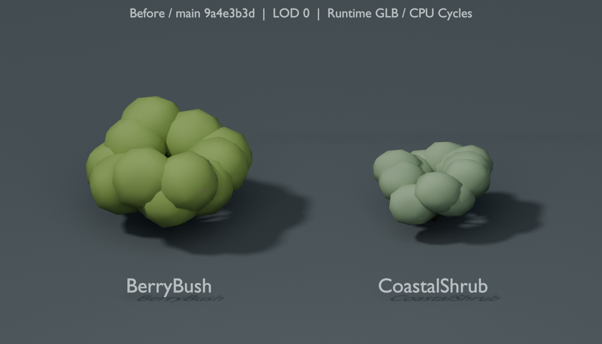
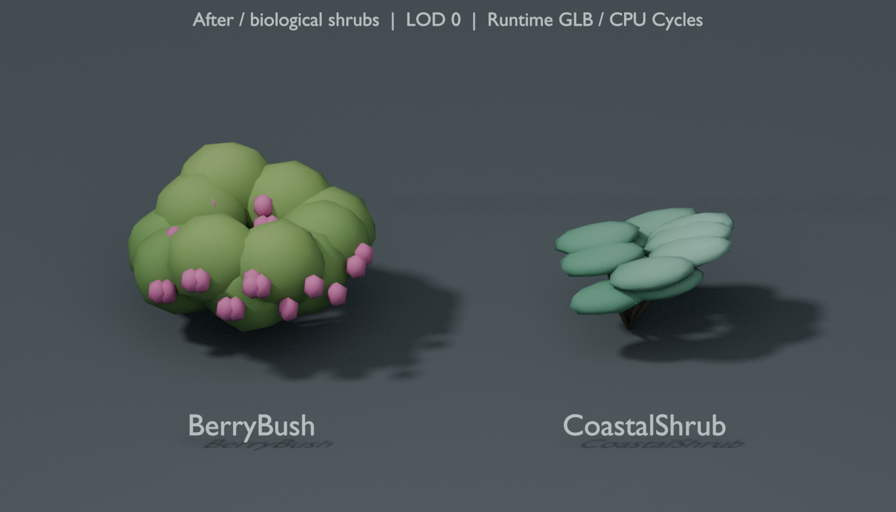

# Island shrub art review — 2026-10-09

Base: `9a4e3b3dea9ff1b8b63bf60fde5f2a8385e50c9b`.
Scope: BerryBush and CoastalShrub source art, their two runtime GLBs, and their
existing manifest registrations. This is an art review, not architecture or
gameplay acceptance evidence.

Both shrubs previously read as similar round green canopy masses; BerryBush's
small fruit was mostly hidden inside those masses. BerryBush now exposes larger
orchid fruit clusters while retaining natural green dominance. CoastalShrub's
leaf groups are flattened, layered and swept in a consistent wind direction,
with sea-glass growth-tip color. The overview berry clusters use their existing
three faces as compact pods, rather than enlarging separate flat triangles.

The editable source is `island-biological-shrubs.blend`, with six LOD meshes in
metres and ground-centred pivots. It is explicitly reconstructed from the exact
pre-pass runtime GLBs. The original Blender 5.2 library and its packed references
remain byte-retained; the available Blender 4.3 cannot read its newer header.
For these two species, the new source owns the current art. The normal export
command loads its current edits; the guarded bootstrap takes only the exact
pre-pass GLBs and prevents applying the pass to already edited exports.

The export retains one shared painted material and one primitive per LOD.
Normalized byte vertex colors retain the existing `COLOR_0` binding. The color
packer accepts Blender 4.3 linear float output as well as newer UNORM16 output,
and pads RGB8 vertex elements to the required four-byte stride. No new textures,
shaders, meshes, material slots, world placements or gameplay code are added.

## Actual isolated render evidence

These images import the runtime GLBs and use the same orthographic camera,
daylight, ground, AgX transform and CPU Cycles settings. LOD0 is shown here;
the locally prepared pack also includes matching LOD1 and LOD2 views. Every preview was
visually inspected. These are deliberately isolated model reviews: they do not
establish Bevy/game appearance, physical-GPU acceptance, FPS or causal gameplay.

Before:

After:

## Focused checks

| Contract | BerryBush | CoastalShrub |
|---|---:|---:|
| LOD0 triangles | 1872 | 1152 |
| LOD1 triangles | 825 | 506 |
| LOD2 triangles | 326 | 218 |
| Bounds change, every LOD | 0 metres | 0 metres |
| Runtime size | 74,340 bytes | 44,788 bytes |
| Native reload/re-export | Byte-identical | Byte-identical |
| Khronos glTF errors/warnings/infos | 0/0/0 | 0/0/0 |

All counts remain at their original budgets. The two GLBs add 96 bytes in total.
Names, paths, identity transforms, scene roots, material binding and bounding
boxes remain stable. All 48 manifest entries validate; metadata changes are
limited to the two refreshed registrations' export recipe, date, size and digest.
The check byte-compares 104 other art/world files against the base, including
Flowers, all three boulders, Fern, trees, terrain/placements/physics data,
Hearthling and the approved dorsal right hand.
The intentionally updated asset README is listed separately in the receipt.

The existing island checker passes: 201,960 terrain vertices agree with the
authoritative heightfield within 0.000001 metres, 3,716 placements and 1,716
collision proxies remain consistent, and all five hand clips retain their rig
contracts. The current asset-bundle test target passes four cases, with no
failures or ignored tests. Documentation assertions and patch whitespace pass.

Machine-readable evidence: [structural check](2026-10-09-island-biological-shrubs/structural-check.json),
[glTF validation](2026-10-09-island-biological-shrubs/gltf-validation.json),
[source/export identity](2026-10-09-island-biological-shrubs/source-consistency.json).

## Limits and ownership

Library materialization of the previous island/character packs and the new
Flowers and boulders packs/previews failed locally with
`library file transfer failed: download failed` (exit 1), including one bounded
retry per item. Resolved Library IDs were passed to `prepare_materialize`, then
the complete returned transfer was passed to the current bundled download helper
with a consumer-local destination. No readable pack bytes were obtained and none
were installed. Outgoing Library upload failed at
`hosted apps tools/list request failed: network`; no new Library IDs were returned.
The GitHub branch carries the sources, exports, near-LOD previews and receipts.
This pass is derived from committed main assets. The parent owns
the separate Flowers and boulder work. Earlier unpublished boulder experiments
were reserved outside this branch and their committed files restored before
this review. No other dirty checkout was modified.

Game rendering, physical GPU execution and interactive acceptance are unrun.
No training, gameplay/cognition changes or user-PC activity was performed.
