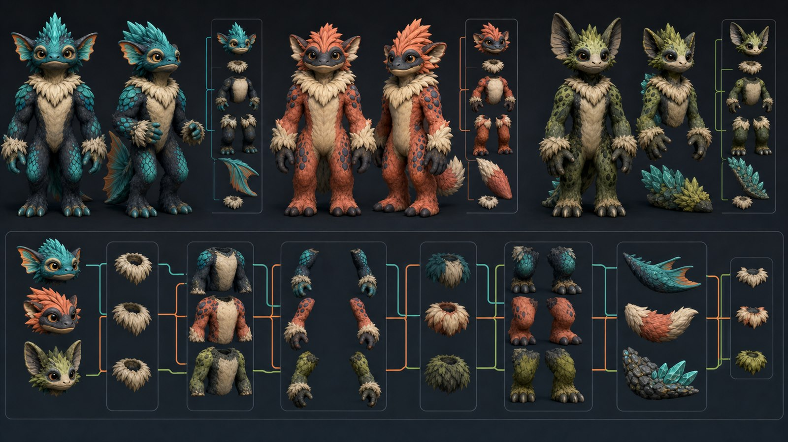

# Modular Creature Mesh Assembly Design

**Date:** 2026-07-12

**Status:** Approved design; implementation not started

**Scope:** Replace whole-animal runtime meshes with heritable modular assemblies
created by a deterministic offline slicing pipeline.



## Goal

Cut the current licensed creature meshes into reusable anatomical parts and
reassemble them into coherent cute bipedal creatures. Founders use compatible
parts from one family. Offspring inherit individual parts from their parents.
Ordinary mutations remain compatible; rare high-mutation events may introduce
one strange cross-family part while preserving a grounded bipedal silhouette.

The system must support adding future source meshes through data and tooling,
without adding source-family match statements or bespoke renderer code.

## Non-Goals

- Do not change action selection, cognition, physics authority, or world truth.
- Do not put Bevy, wgpu, mesh, material, or renderer types in `alife_core` or
  `alife_world`.
- Do not add runtime mesh slicing, arbitrary runtime constructive geometry, or
  startup-time source-OBJ processing.
- Do not duplicate whole source meshes and all generated parts in the shipped
  asset pack.
- Do not expose hard mechanical sockets, stitched-toy seams, open cuts, or
  detached anatomy in the production camera.
- Do not require Blender or a private tool to run the game.

## Chosen Approach

Use a deterministic Rust offline builder. It consumes licensed source OBJs and
committed cut profiles, then emits sliced part meshes, socket metadata, join
cover metadata, LOD mappings, digests, and production manifest entries.

The generated part meshes replace whole runtime OBJ meshes. The shipped game
loads only the generated packs and catalog. Source assets may remain available
to the developer pipeline only when repository size and license policy allow;
they are not duplicated in the production runtime pack.

Runtime slicing was rejected because it repeats deterministic work, complicates
failure handling, and increases startup cost. Fully manual Blender segmentation
was rejected as the primary pipeline because it is difficult to reproduce and
does not scale to newly added families. Cut profiles may contain authored
landmarks, but the builder owns repeatable output generation and validation.

## Anatomical Part Contract

Every family must produce these logical slots for every supported LOD:

| Slot | Cardinality | Required | Notes |
|---|---:|---:|---|
| `Head` | 1 | yes | Includes face and source-specific cranial silhouette. |
| `Torso` | 1 | yes | Defines the root scale and principal socket frame. |
| `ArmPair` | 2 mirrored parts | yes | May derive from forelimbs, fins, wings, or tentacles after biped adaptation. |
| `LegPair` | 2 mirrored parts | yes | Must terminate in grounded feet. |
| `TailBack` | 0 or 1 | no | Tail, plume, dorsal feature, shell, or equivalent back silhouette. |
| `JoinCovers` | bounded set | yes | Neck ruff, shoulder tufts, cuffs, hip fur, and tail-base cover. |

The builder retains each source triangle's UVs and normals. Species-specific
cut volumes and landmark planes assign and clip triangles into slots. Crossing
triangles are clipped deterministically rather than copied into two visible
parts. Open boundaries are permitted only inside declared overlap zones hidden
by join-cover geometry.

Generated parts use normalized local coordinates around their declared socket.
The torso carries neck, left/right shoulder, left/right hip, and tail sockets.
Heads, paired limbs, and tail features carry matching attachment sockets.

## Extensible Family Registry

The catalog uses an append-only `CreaturePartFamilyId(u16)`. IDs never depend on
array order, filenames, or the current number of families. An assigned ID is not
reused, even after an asset is retired. This prevents later catalog additions
from reinterpreting existing saves.

Each `CreaturePartFamilyDefinition` records:

- stable family ID and display label;
- source asset IDs, author, license, license reference, and digests;
- source orientation, unit scale, and anatomical landmarks;
- cut volumes for every anatomical slot;
- normalized socket frames and allowable socket-scale ranges;
- overlap depth and join-cover recipes;
- compatibility tags and explicit substitution rules;
- rare-mutation compatibility rules;
- texture/material source IDs;
- supported LOD inputs and generated outputs;
- builder schema and output schema versions.

Initial compatibility tags include `mammalian`, `aquatic`, `compact`,
`long-neck`, `tailless`, `wing-arm`, `fin-arm`, `tentacle-arm`, `plume-tail`,
and `heavy-torso`. Tags are data, not Rust enum exhaustiveness requirements.

Adding a future mesh consists of assigning a new stable ID, supplying licensed
assets and one cut profile, running the builder, inspecting its preview, and
committing validated generated outputs plus manifest metadata. Runtime renderer
code must not change merely because a family was added.

## Heritable Appearance Schema

`CreatureAppearanceGenome` advances to schema version 2 with stable family IDs
for these heritable genes:

```text
head_source
torso_source
arm_source
leg_source
tail_source
```

Existing palette, fur pattern, marking density, accessory, ear/muzzle, tail,
body-mass, mutation-count, and bipedal traits remain renderer-neutral saved
state in `alife_world`.

Schema-v1 migration maps every old creature to a coherent schema-v2 recipe
using its existing species archetype. This migration is deterministic and
preserves all existing non-part appearance genes. Unknown schema-v2 family IDs
produce a visible migration warning and resolve to the saved torso family's
coherent fallback recipe; they do not crash or silently change simulation state.

## Inheritance And Mutation

For each part gene, offspring select one parental value using the existing
deterministic mutation seed path. Normal mutation may substitute a family only
when catalog compatibility rules permit it for that slot and torso family.

Rare cross-family mutation is enabled only after a deterministic high-mutation
threshold. It may replace at most one incompatible source slot in a birth. The
assembly validator must still prove:

- one head and torso;
- paired arms and paired legs;
- two grounded feet;
- finite, bounded transforms;
- socket-scale ratios inside catalog limits;
- no inverted part scale;
- no detached part bounds;
- a valid join cover for every visible attachment.

Mutation changes appearance only. It does not grant actions, cognition,
strength, sensing, locomotion authority, or hidden gameplay capabilities.

## Runtime Assembly

`alife_game_app` resolves a saved appearance genome and the catalog into a pure
app-local `CreatureAssemblyRecipe`. The recipe contains stable part-family IDs,
part asset references, socket transforms, material references, cover recipes,
and inherited visual parameters.

Bevy spawns one display-only creature root with child entities for the torso,
head, paired arms, paired legs, optional tail/back feature, and bounded join
covers. Mesh and material handles are cached by family, slot, and LOD. Creatures
reuse handles instead of cloning mesh assets per organism.

The torso transform is the assembly root. Other parts attach through normalized
socket transforms. Body-mass and source-proportion genes may vary part scales
only within catalog bounds. Join covers overlap both adjacent parts and receive
a blended material tint so texture changes read as fur pattern transitions
rather than toy seams.

The renderer reads saved appearance state and never writes part choices back to
the genome. It cannot authorize actions, bypass arbitration, mutate cognition,
assign rewards, or rewrite weights.

## LOD Policy

Every family must provide outputs for the three existing product LOD classes:

- `FullVoxel`: highest available sliced source LOD;
- `CompactVoxel`: comfort/minimum gameplay assembly;
- `ImpostorVoxel`: lowest geometric part set with the same logical sockets.

Part-family selection remains identical across LOD changes. LOD switching may
replace mesh handles and simplify join covers but cannot change inherited source
IDs, silhouette ownership, or saved state.

## Offline Builder

The `alife_tools` binary exposes commands equivalent to:

```text
creature-part-builder build --catalog <path> --family <id>
creature-part-builder validate --catalog <path>
creature-part-builder preview --catalog <path> --family <id> --lod <lod>
creature-part-builder manifest --catalog <path>
```

Build output is deterministic for identical source bytes, profile bytes, and
builder version. The builder rejects:

- missing or unlicensed source assets;
- duplicate or reordered family IDs;
- missing required slots or LODs;
- invalid OBJ indices, UVs, or non-finite normals;
- unowned or multiply owned triangles after clipping;
- sockets outside source bounds;
- unpaired limbs or ungrounded feet;
- overlap zones without cover geometry;
- output files beyond production asset budgets;
- manifest digest or size mismatches.

Preview output belongs under ignored `target/artifacts/` and is never required
at runtime. The production game consumes only validated generated part assets
and catalog metadata.

## Error Handling

Builder failures include the family ID, source asset, LOD, slot, and violated
invariant. They do not emit partial production manifests. Output is written to a
staging directory and promoted only after family-level validation passes.

Runtime catalog loading fails clearly for missing production assets or invalid
catalog schemas. A save containing an unknown but well-formed family ID uses a
coherent visible fallback with a warning. A malformed appearance genome remains
a save-validation error rather than being repaired inside the renderer.

## Asset And License Policy

Every source and generated part asset remains manifest-recorded with source,
author, license, license reference, digest, size, usage category, builder
version, and replacement policy. Current Quirky Series assets retain Omabuarts
attribution and `CC-BY-4.0` metadata.

Do not commit source archives, Blender caches, previews, screenshots, temporary
cut meshes, or duplicate whole-mesh and part-mesh runtime packs. The generated
production part pack must remain within the repository's bounded per-file and
total production asset limits.

## Validation And Visual Acceptance

Automated validation must cover:

- deterministic part output and manifest generation;
- all triangles assigned exactly once after clipping;
- UV, normal, index, bounds, and socket validity;
- catalog append-only ID stability;
- adding a synthetic ninth family without renderer code changes;
- schema-v1 to schema-v2 save migration;
- schema-v2 save/load roundtrip;
- parental per-slot inheritance;
- compatible ordinary mutation;
- bounded rare incompatible mutation;
- unknown-family fallback and warning;
- unchanged source IDs across LOD transitions;
- shared mesh/material handle reuse;
- renderer display-only authority markers;
- core boundary and docs checks;
- full production asset validation.

Fresh release screenshots are required for `MinimumSettings30x30` and
`MinSpecComfort1080p`. Compare them against the blueprint in this spec and the
current accepted terrain captures. Reject the pass if screenshots show:

- recognizable unmodified source animals instead of assembled creatures;
- exposed holes, mechanical sockets, stitched seams, or detached parts;
- floating or non-bipedal creatures;
- extreme part-scale mismatches;
- loss of species and mutation diversity;
- join covers that obscure faces, hands, feet, or inherited markings;
- debug overlays in the default product view;
- regressions to the accepted terrain composition.

## Architecture Decision Impact

No new ADR is required. This design extends the existing renderer-neutral saved
appearance model and app-owned display projection without changing authority
boundaries. If implementation later moves mesh handles, socket transforms, or
renderer resources into `alife_core` or `alife_world`, that would violate this
design and the controlling architecture rather than constitute an extension.
