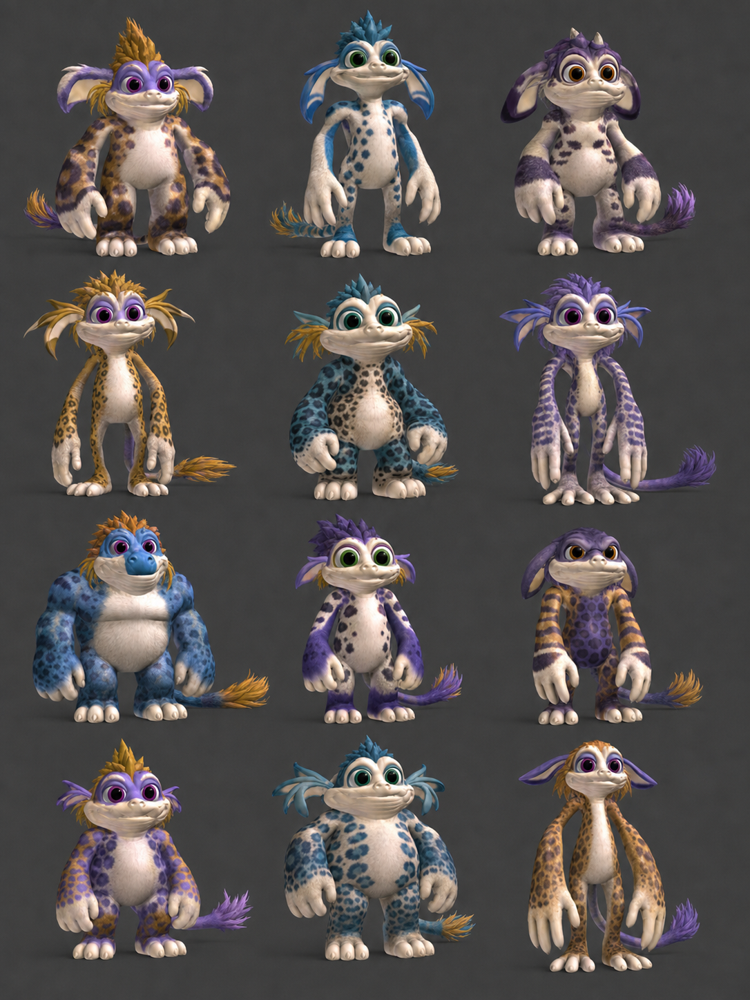

# GeneForge Frankenstein Creature Roster Design

**Date:** 2026-07-17

**Status:** Approved direction; supersedes the eight-family visual target in the
2026-07-15 creature visual remediation plan

**Scope:** Replace the rejected procedural creature geometry with twelve
cohesive, heritable bipedal creature families assembled from normalized
GeneForge Norn, Ettin, and Grendel body parts.



## Goal

Ship twelve visibly different, cute, mammalian-leaning alien bipeds whose
geometry is deliberately Frankenstein-assembled from GeneForge source parts.
The body parts may come from different donors, but every creature must read as
one animal because its coat, markings, material response, attachment covers,
face treatment, and proportions are cohesive.

The result must replace the current hat-like heads, collapsed torsos, black-bead
eyes, and color-swap families. It must preserve heritable part selection,
appearance mutation, save compatibility, GPU-authoritative cognition, and world
authority.

## Controlling Boundaries

- GeneForge assets are offline art inputs. Blender is never a game dependency.
- `alife_world` owns only renderer-neutral stable IDs and heritable appearance
  genes. It imports no Bevy, wgpu, mesh, material, image, or Blender types.
- `alife_game_app` and `alife_tools` own geometry recipes, part assets, sockets,
  surface masks, coat generation, materials, and rendering.
- The renderer remains display-only. It cannot select actions, mutate cognition,
  assign rewards, alter physics, or change authoritative world state.
- Existing schema-v2 saves retain their exact five part-family IDs.
- Historical schema-v1 migration remains modulo eight and is never silently
  reinterpreted as modulo twelve.
- No source `.blend`, archive, bake cache, preview, or screenshot is committed.
- Production outputs remain bounded, digest-recorded, licensed, and
  deterministic.

## Current Defects Being Replaced

The active worktree currently generates eight animals from a Python primitive
profile table rather than from the catalog's licensed source meshes. Each
family has one texture, and a mixed assembly binds each selected donor family's
texture to that donor's part. This makes inherited mixed bodies look patched
together instead of genetically coherent.

Face and body details are separate generic primitives with hard-coded offsets.
That produces hats, pasted-on torsos, black bead eyes, and repeated silhouettes.
The generated 24 OBJ packs plus eight textures already consume about 6.2 MiB,
so duplicating twelve full bodies would also exceed the existing 8 MiB
production asset budget.

## Chosen Architecture

Use three separate identities:

1. `CreaturePartFamilyId` is the stable saved family gene. Production IDs are
   append-only `0..=11`.
2. `CreaturePartAssetId` is an app-local generated mesh/detail asset. Multiple
   families may reuse one normalized donor part without duplicating triangles.
3. `CreatureCoatKey` is a renderer-local cache key derived from the complete
   selected part-source set and inherited coat genes. It never derives color
   identity from a donor asset.

The catalog advances to v2 and contains two registries:

- a generated part-asset registry with source provenance, slot, LOD, OBJ group,
  local attachment frame, bounds, semantic UV layout, and detail landmarks;
- a twelve-family recipe registry mapping each logical slot to one part asset
  plus a bounded authored fit and join-cover recipe.

The runtime resolves saved family IDs into family recipes, then resolves each
slot recipe into a shared generated mesh. A new family or source mesh is data
and offline-build work; adding it does not require a renderer match arm.

## Logical Part Contract

The saved contract remains five independently heritable sources:

| Saved gene | Runtime geometry |
|---|---|
| `head` | Head shell, muzzle, cheeks, ears, source hair/crest, eyes, and lids |
| `torso` | Chest, belly, pelvis, neck base, and principal socket frame |
| `arms` | Mirrored upper/lower arms and hands |
| `legs` | Mirrored thighs, shins, and planted feet |
| `tail` | Tail or bounded back silhouette feature |

Generated assets may contain finer internal groups, but those groups do not
become save fields. Each slot provides all three production LODs and a common
attachment contract.

## Twelve Founder Families

`N`, `E`, and `G` below mean GeneForge Norn, Ettin, and Grendel geometry. Every
family uses all three donor lineages, and no family reproduces one stock donor
body. The fit values are offline shape targets, not runtime gameplay traits.

| ID | Production label | Head | Torso | Arms | Legs | Tail/back | Minor authored changes |
|---:|---|---|---|---|---|---|---|
| 0 | `tuftback` | N | E | G | N | G | Wide swept ears, short gold crest, broad forearms |
| 1 | `tideclimber` | E | N | N | G | G | Narrow muzzle, blue fin-like ear sweep, long calves |
| 2 | `mossknuckle` | G | E | N | E | N | Softened brow, round ears, heavy hands, low tail plume |
| 3 | `emberloper` | N | G | E | G | N | Tall crown tuft, compact chest, long springing legs |
| 4 | `duskmane` | E | G | N | N | G | Drooped ears, broad cheeks, short dense purple mane |
| 5 | `reefburrower` | G | N | E | E | G | Rounded snout, thick shoulders, short planted stance |
| 6 | `velvetreed` | N | E | N | G | G | Long ear fins, slim torso, long arms, narrow feet |
| 7 | `copperskipper` | E | N | G | E | N | Upturned ear tips, compact hands, swept copper tail |
| 8 | `slateprowler` | G | G | N | E | N | Reduced muzzle ridge, wide chest, medium athletic limbs |
| 9 | `cobaltbramble` | N | G | G | E | N | Short ears, two-tone crest, powerful upper body |
| 10 | `orchidstout` | E | E | G | N | G | Round face, low ears, barrel torso, short sturdy legs |
| 11 | `amberlongstep` | G | N | N | G | G | Large soft ears, slim chest, very long hands and feet |

Minor changes are intentionally bounded. Head width, muzzle length, limb length,
ear angle, crest size, torso depth, and tail extent may vary by at most 12% from
the normalized source part unless a visual audit explicitly approves a larger
value. Modifiers are applied and baked offline; production runtime transforms
remain finite, authored, and attachment-safe.

## Founder Mapping And Save Compatibility

`CREATURE_APPEARANCE_SCHEMA_VERSION` remains 2. No new save field is needed.
The existing global genes already describe coat palette, fur pattern, marking
density, ear/muzzle variation, tail variation, body mass, and mutation count.

Two family counts become explicit:

- `LEGACY_CREATURE_PART_FAMILY_COUNT = 8` controls schema-v1 migration forever;
- `PRODUCTION_CREATURE_PART_FAMILY_COUNT = 12` controls newly created founders.

New species founders map through this fixed table:

```text
species  0  1  2  3  4  5  6  7  8  9 10 11 12 13 14 15
family   0  1  2  3  4  5  6  7  8  9 10 11  3  6  9  0
```

Existing schema-v2 saves retain their exact IDs. Unknown IDs still produce a
visible warning and coherent fallback. IDs `0..=7` are visually replaced but
not reused or reordered; IDs `8..=11` are appended.

Part inheritance and mutation remain unchanged: offspring may inherit a head,
torso, arms, legs, and tail from either parent, subject to the existing
compatibility validator. Mutation affects appearance only.

## Source Extraction Pipeline

The deterministic Blender batch importer is pinned to Blender `5.1.0` and
consumes these developer-local files:

```text
Geneforge4/Norn/Geneforge_r4.0_Norn.blend
Geneforge4/Ettin/geneforge_r4.0_ettin.blend
Geneforge4/Grendel/geneforge_r4.0_grendel.blend
```

The verified source SHA-256 values are:

```text
Norn    B6E5C1BC0E0EC69995748B211F45EFF787B9162DBC4856A1AB7F48F3E610FB4A
Ettin   CC1D2AA1D310BCEA3D39FE495BF756A9B3650ECF0F3C9EEE8AC8488609202B0B
Grendel 3289BBD6D7CAEDF7CCA44175E63B60B4140D26EE2E86CCAD7A89FA8724132E62
```

The source page names Blender 3.5, but this production pipeline uses the exact
locally verified Blender 5.1.0 build. Promotion requires a committed synthetic
compatibility fixture proving constraint evaluation, mirrored geometry,
armatures, image relinking, UV baking, and deterministic export on that build.
The importer rejects every other Blender version rather than producing
unreviewed geometry.

Headless inspection with Blender 5.1.0 found 105 Norn, 31 Ettin, and 68
Grendel mesh objects. All three files expose stable
`kc3dsbpy_part_marker` values for head, body, left/right thigh, shin, foot,
upper/lower arm, tail root, and tail tip. The importer reconstructs sockets
from marker IDs `1..=14`; it never depends on object order or collection order.

Norn and Ettin share similar limb marker coordinates. Grendel uses a materially
different authored frame and a translated body object, so all donors must be
normalized independently before any cross-donor attachment. The source PPU
custom property is not a geometric scale and must not be used as one.

The source scenes also contain known repair work:

- Norn tail geometry depends on two armatures;
- Grendel tail geometry uses parented root/tip attachment-point chains;
- Ettin has no tail, so an Ettin tail selection is invalid;
- Ettin lower-arm geometry has one non-manifold edge;
- Grendel lower-arm geometry has four non-manifold edges;
- raw body/head boundaries do not meet and require an authored bridge recipe;
- Norn expression variants are discrete topology choices, while Ettin and
  Grendel expression variants may become shape keys only after topology QA.

The exact texture roots used for relinking are:

```text
Norn/Blueberry Norns Example/Geneforge Textures
Ettin/Teal Ettin Textures
Grendel/Purple Grendels Textures
```

Norn maps are mostly packed. Ettin and Grendel maps are present beside the
sources but their stored Blender paths are stale, so basename relinking is a
required, validated importer step. Norn normally uses `UVMap`; Ettin and
Grendel body/limb/head geometry normally uses `UVChannel_1`, while their feet
may use `UVMap`.

The source files use GeneForge's pivot/constraint body system. The importer:

1. opens a source file in background mode using the discovered Blender binary;
2. relinks external images by basename from the adjacent source directories;
3. selects catalog-declared semantic objects rather than collection order;
4. evaluates constraints and modifiers at the authored adult neutral pose;
5. applies transforms, triangulates deterministically, merges only declared
   detail objects, and recalculates smooth finite normals;
6. converts the selected geometry into the common A-Life forward/up/scale frame;
7. derives named attachment frames from source pivots, then normalizes them to
   the common socket contract;
8. bakes source color into grayscale microdetail and RGBA semantic masks;
9. emits optimized OBJ groups, metadata, masks, source digests, and a preview;
10. validates the staging output before atomically promoting production files.

The importer script and JSON recipes are committed. Source `.blend` files and
full source textures remain developer-local. Missing sources produce an exact
setup error and never cause the game to fall back to procedural mock creatures.

## Attachment System

All generated parts use a right-handed canonical frame with `+Y` up and `-Z`
forward. The torso carries:

```text
neck
left-shoulder
right-shoulder
left-hip
right-hip
tail-base
```

Attached parts carry matching local attachment frames. Socket metadata includes
translation, normalized quaternion, uniform fit scale, overlap depth, allowable
scale ratio, and a pattern phase anchor. Runtime assembly computes:

```text
torso_socket * inverse(part_attachment) * authored_family_fit
```

The builder rejects missing sockets, non-unit quaternions, non-finite values,
inverted scale, excessive scale ratios, detached bounds, ungrounded feet, open
cuts outside overlap zones, and visible attachment error above `0.025` canonical
units. Join covers use fur ruffs, shoulder tufts, hip fur, cuffs, or tail-base
fur shaped from source geometry. They are never hard rings or mechanical caps.

## Cohesive Coat System

Geometry provenance and coat identity are deliberately independent.

Every generated part is remapped into `alife.creature_semantic_uv.v1`, a single
atlas with stable regions for head, torso, left/right arms, left/right legs,
tail, and join covers. The offline bake provides, per part asset:

- base-fur microdetail;
- belly/muzzle/inner-ear mask;
- secondary marking mask;
- keratin/skin mask;
- eye and mouth regions when integrated into the head;
- pattern phase and scale metadata.

At spawn, a pure app-local coat baker combines the selected slot assets' atlas
regions with the inherited `palette_family`, `fur_pattern`, and
`marking_density`. It emits one bounded RGBA coat atlas and one cached
`StandardMaterial` for the entire assembly. Every body part and join cover uses
that same material handle.

The coat key includes all five selected family IDs plus every gene that changes
the atlas. It does not include expression, donor asset ID, animation state, or
simulation state. Different donor parts therefore retain their fur grain and
semantic anatomy while sharing one bold palette and marking language.

Production palettes are saturated and high contrast, with a value difference
of at least `0.28` between primary and secondary coat colors. Pastel-only
palettes are rejected. Supported pattern families include spots, broken spots,
broad stripes, narrow bands, saddle, mask, dorsal field, limb rings, mottling,
and sparse rosettes. Pattern density and phase are deterministic.

The baker is CPU image generation for display assets only; it is not a neural
fallback, action policy, or simulation authority. Atlases are generated lazily,
cached by `CreatureCoatKey`, and bounded to at most 256x256 RGBA8 for comfort
and minimum profiles.

The cache is also count- and byte-bounded:

| Profile | Resident atlases | RGBA bytes |
|---|---:|---:|
| `MinimumSettings30x30` | 48 | 12 MiB |
| `MinSpecComfort1080p` | 96 | 24 MiB |
| future scale-up | 256 | 64 MiB |

A deterministic least-recently-used policy may evict only coat keys not used by
a live creature entity. Eviction removes both Bevy `Image` and
`StandardMaterial` assets. A key still referenced by a live assembly is pinned;
if all entries are pinned, a new coat uses the nearest existing inherited coat
bucket with an explicit diagnostic instead of growing without bound.

## Face And Eye Quality

The generated head owns its muzzle, cheeks, brow planes, ears, crest/hair, eye
sockets, and eyelid geometry. Generic floating muzzle patches and hat blocks
are removed.

Eyes use source-derived ovoid geometry and head landmarks. Each eye has warm
sclera, saturated inherited iris, a bounded pupil, a small glint, and upper/lower
lids. The pupil occupies no more than 45% of the visible iris diameter. Eyes
must remain embedded in the sockets from front and three-quarter views and may
not read as detached black beads.

Blink and expression transforms may move eyelid/detail groups but cannot move
the head socket or alter world state. At compact and impostor LOD, eyes may
simplify while retaining sclera, iris, pupil, and face readability.

## LOD And Asset Budget

The shared part registry avoids twelve duplicated bodies. Each unique normalized
donor part is stored once per LOD and reused by family recipes.

- `FullVoxel`: source silhouette and facial detail, decimated only after visual
  comparison.
- `CompactVoxel`: shipping comfort geometry with readable hands, feet, ears,
  muzzle, eyes, and crest.
- `ImpostorVoxel`: low-poly geometry with identical sockets and coat atlas
  regions; not a colored blob.

The promoted production pack remains within the existing 8 MiB budget unless a
separate reviewed budget change documents why it is necessary. No single file
may exceed the manifest's existing per-file cap. Mesh reuse, indexed OBJ output,
bounded masks, and removal of the rejected eight packs are preferred over a
budget increase.

## Asset And License Policy

GeneForge R4 provenance is recorded as Eem Foo, source
`https://eem.foo/geneforge/`, MIT per the project owner's explicit statement in
this work session, with a digest for each exact `.blend` input. Because the
local archive and source page do not themselves contain the MIT text, promotion
also requires a checked-in provenance receipt that states exactly which
permission evidence was supplied, what evidence was absent, and who supplied
it. The receipt must not invent an upstream copyright line or imply that the
website displays a license it does not display.

The manifest `license_ref` points to that receipt and the repository retains any
exact distributable MIT notice or immutable permission evidence supplied before
promotion, plus source URL, author, local input basename, input digest, pinned
Blender version, importer version, recipe digest, generated digest, size, and
modification statement.

The source page does not need to be reachable to run the game. Production ships
only transformed generated meshes, bounded semantic masks, attribution text,
and manifests. Quirky Series attribution remains only for any assets still used
after the replacement; removed runtime assets must also be removed from the
manifest rather than left as misleading provenance.

## Error Handling

- Import/build errors identify donor, source file, object selector, family,
  slot, LOD, and failed invariant.
- Staging output is never partially promoted.
- The game fails clearly when a required production mesh, mask, or manifest
  entry is missing. It does not spawn a primitive substitute.
- Unknown saved family IDs use the existing coherent visible fallback and
  a visible app diagnostic/overlay warning without rewriting the save inside
  the renderer.
- A coat bake failure reports the key and uses one catalog-declared production
  fallback coat, never a debug pink material or donor texture patchwork.

## Automated Acceptance

Tests must prove:

- catalog v2 contains exact append-only IDs `0..=11`;
- every founder family uses all three donor lineages and no stock full-body
  donor recipe;
- a synthetic thirteenth family can be added through catalog data without
  renderer changes;
- every required slot, detail group, LOD, semantic UV region, socket, bound,
  and source digest is valid;
- all 12 recipes are visually distinct by geometry, not only coat values;
- v1 migration remains modulo eight and schema-v2 IDs `8..=11` round-trip;
- parental part inheritance and bounded mutation remain deterministic;
- every rendered body part and join cover for one creature shares one coat
  material handle;
- changing a donor source does not change resolved coat colors;
- changing inherited palette, pattern, or density changes the coat atlas;
- no `% 8`, eight-entry morphology array, or 24-pack assertion controls current
  production rendering;
- face landmarks produce two embedded readable eyes with sclera, iris, pupil,
  glint, lids, brow, and muzzle;
- upright, walking, resting, sleeping, hurt, and dead poses remain grounded and
  attachment-safe;
- generated production assets and attribution pass digest, size, and manifest
  validation.
- generational coat churn remains inside the active profile's resident count and
  byte limits, including removal of evicted Bevy image/material assets;
- renderer startup, coat baking, spawning, animation, and capture leave an
  authoritative before/after snapshot of world state, candidates, actions,
  outcomes, rewards, and cognition byte-semantically unchanged.

## Visual Acceptance

Generate labeled, fixed-cell front, three-quarter, and back atlases for all
twelve families at full, compact, and impostor LOD, plus pose atlases for
upright, resting, and sleeping. Every cell records family ID/label, exact part
recipe, coat key, fixed orthographic camera, fixed neutral three-point lighting,
neutral gray background, pixel occupancy, eye occupancy, socket error,
foot-ground error, and silhouette-distance score.
Then capture fresh `MinimumSettings30x30` and `MinSpecComfort1080p` runtime
screenshots from the real GPU-authoritative game.

The concept blueprint is style guidance, not proof of family identity or back
seams. Compare actual multi-view captures to it and to each other. Reject
the result if any creature shows:

- a hat, torso slab, fused limb mass, or collapsed body;
- black bead eyes, floating face parts, obscured eyes, or detached lids;
- a stock unmodified Norn, Ettin, or Grendel full-body silhouette;
- donor-colored patchwork, abrupt material seams, or pastel-only contrast;
- exposed sockets, hard join rings, holes, detached parts, or floating feet;
- twelve color variants of one body instead of twelve geometry families;
- dinosaur-first anatomy instead of a cute mammalian/aquatic-ape alien biped;
- terrain, overlay, camera, or runtime regressions unrelated to the creature
  replacement.

## Architecture Decision Impact

No new ADR is required. This design extends the existing renderer-neutral
appearance genome and app-owned display projection. It does not change neural,
action, legality, physics, or persistence authority. Moving mesh IDs, material
handles, Blender concepts, semantic UV layouts, or renderer resources into
`alife_core` or `alife_world` would violate the controlling architecture.
